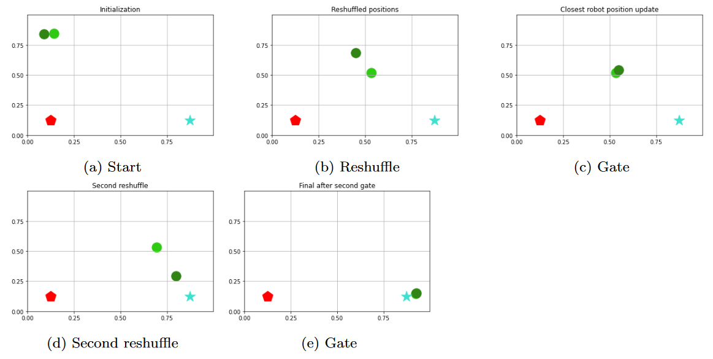

# Quantum planning for swarm robotics

This repository contains the code that implements the procedure proposed in the paper "__[Quantum planning for swarm robotics](https://doi.org/10.1016/j.robot.2023.104362)__" by A. Chella, S. Gaglio, M. Mannone, G. Pilato, V. Seidita, F. Vella, and S. Zammuto.

## Table of Contents

- [Quantum planning for swarm robotics](#quantum-planning-for-swarm-robotics)
  - [Table of Contents](#table-of-contents)
  - [Abstract](#abstract)
  - [Technologies Used](#technologies-used)
  - [Preview](#preview)
  - [Future works](#future-works)
  - [Contact](#contact)
  - [Citation](#citation)

## Abstract

Computational resources of quantum computing can enhance robotic motion, decision making, and path planning. While the quantum paradigm is being applied to individual robots, its approach to swarms of simple and interacting robots remains largely unexplored. In this paper, we attempt to bridge the gap between swarm robotics and quantum computing, in the framework of a search and rescue mission. We focus on a decision-making and path-planning collective task. Thus, we present a quantum-based path-planning algorithm for a swarm of robots. Quantization enters position and reward information (measured as a robot’s proximity to the target) and path-planning decisions. Pairwise information-exchange is modeled through a logic gate, implemented with a quantum circuit. Path planning draws upon Grover’s search algorithm, implemented with another quantum circuit. Our case study involves a search and rescue scenario, inspired by ant-foraging behavior in nature, as an example of swarm intelligence. We show that our method outperforms two ant-behavior simulations, in NetLogo and Java, respectively, presenting a faster convergence to the target, represented here by the source of food. This study can shed light on future applications of quantum computing to swarm robotics.

## Technologies Used

The entirety of the code to build, experiment and execute the both the quantum and classical procedures that make up the porposed algorithm have been realized with IBM's __[Qiskit](https://github.com/Qiskit/qiskit)__ SDK on Python v3.8.2.

Comparisons with classical ant-foraging simulators have been made on __[NetLogo](http://ccl.northwestern.edu/netlogo/)__'s __[Ant Lines](http://ccl.northwestern.edu/netlogo/models/AntLines)__ model and __[this](https://itp.uni-frankfurt.de/~gros/StudentProjects/Applets_2014_AntsSimulation/ants.htm)__ Java simulator from Goethe University in Frankfurt.

Additional technologies used for comparing the quantum swarm-planning algorithm with the above-mentioned resources are a __[Fréchet distance calculator](https://github.com/spiros/discrete_frechet)__ and a __[Dynamic Time Warping algorithm implementation](https://github.com/kamperh/lecture_dtw_notebook)__, that can be found within the `comparison` folder of this repo.

## Preview

The image above shows a code run with a size-restricted swarm of 2 robots, where and additional cycle of the algorithm is required in order to achieve the desired convergence. This is also the kind of problem instance dealt with in the `swarm_with_grover_two_cycles.ipynb`.

## Future works

In our work, we ran the code on our laptop, remotely calling the IBMQuantum simulator. However, the whole idea of the swarm also includeslocal calculations and exchanges of information. Therefore, next steps ofthe work will include the definition of an MQTT (Message Queuing Teleme-try Transport) message-exchanging technique. A completely decentralized robotic swarm delegates simple calculations to all elements of the swarm, realizing a fully-distributed structure.

Indeed, a quantum swarm algorithm can be considered a form of quantum distributed algorithm, enhanced by the quantum component. Thus, the multiple processors required in a distributed algorithm can be identified with the simple processors integrated on each robot of the swarm. In addition, further research can address comparisons with Markov-based decision processes, comparing Markovian (memory-less) with non-Markovian time evolution, analyzing the necessary amount of information to be retained for a successful search and rescue swarm mission. The forthcoming application of the proposed code to MQTT will prepare the ground for tests with real robots. Regarding possible future experiments, we envisage a test with three Peppers. Pepper is a complex robot, diverse from robots usually exploited for swarm robotics. However, mechanisms of message exchanging, position set up, path planning, obstacle avoidance can be implemented as well. Thus, we can imagine a toy-swarm constituted by three Peppers. Messages can also be loudly spoken out by robots. The steps of logic gate implementation and path planning of each robot (or, by an external computer connected with robots) can be verbalized through the innerspeech. In such a research, we may borrow results from the quantum vocal theory of sound. Our research is meant to be a further step in quantum-computing resource exploration. The application of quantum logic gates to robotic decision-making systems fosters new developments in rapidly-developing interdisciplinary fields. This line of research opens the way to new scenarios of robotics, industry, and ultimately, human knowledge.

## Contact

The code in this repository has been created and edited by [S. Zammuto](https://github.com/salvatorezam) and [M. Mannone](https://github.com/medusamedusa). For any inquiry about the implementation, feel free to contact us!

## Citation

For citing this research, please refer to the DOI __[https://doi.org/10.1016/j.robot.2023.104362](https://doi.org/10.1016/j.robot.2023.104362)__ for the original paper, or access the `CITATION.cff` file for information about the software published in this repository.
